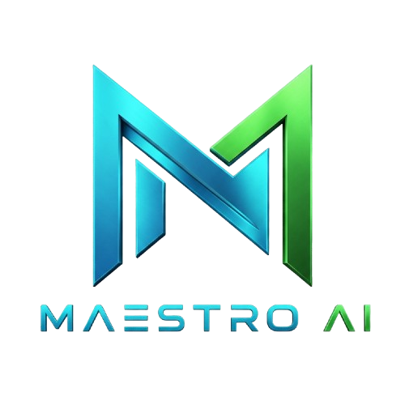
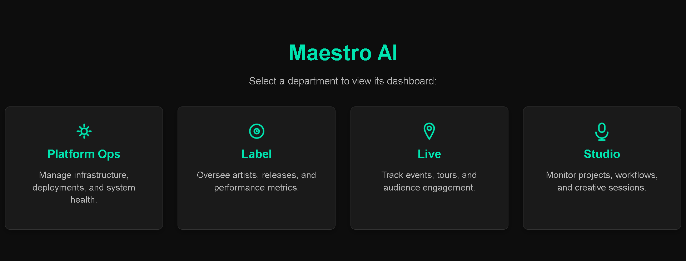
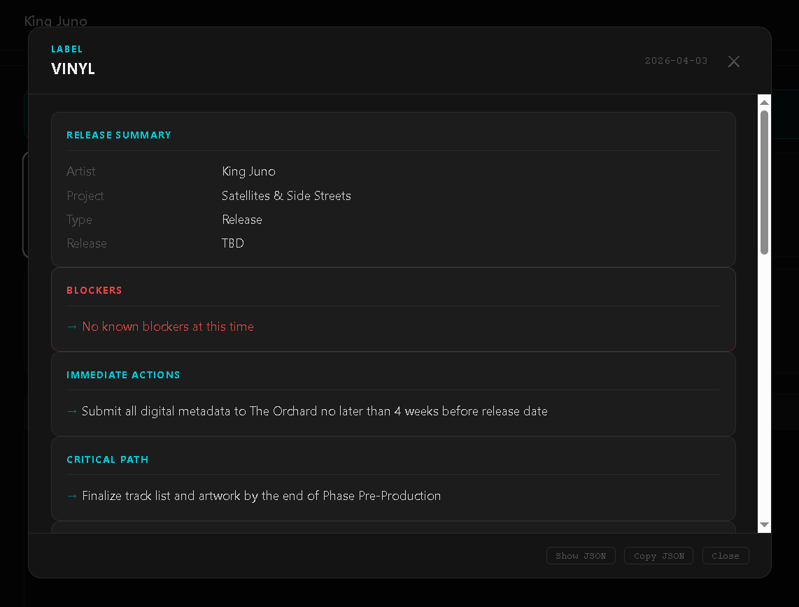
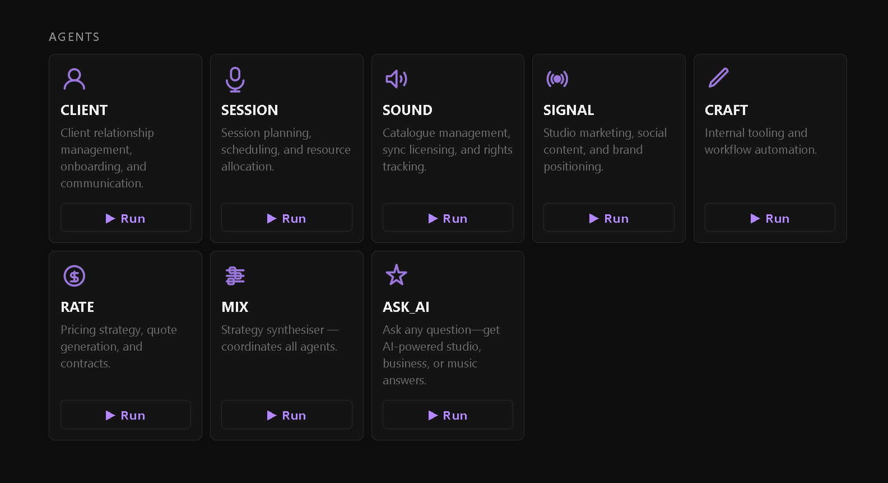
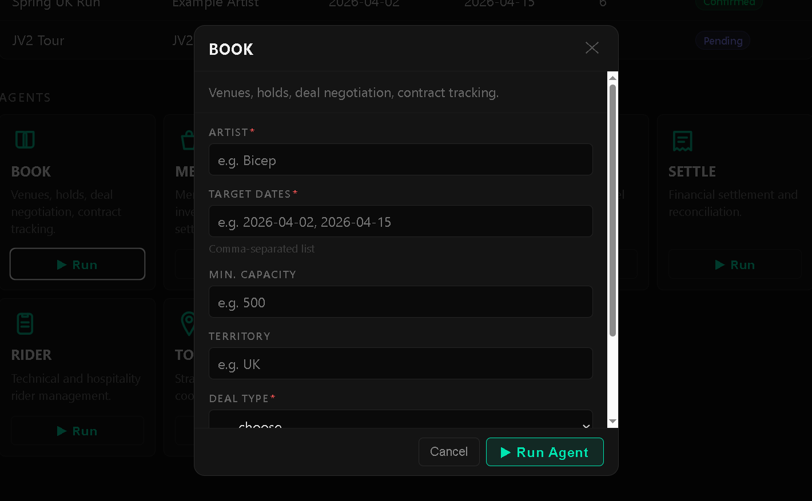

<p align="center">
  
</p>
<h1 align="center">🎼 Maestro AI — The AI Operating System for Independent Music</h1>

**A powerful, extensible, open-source platform that automates and streamlines operations for modern independent labels, studios, and music organizations using multi-agent AI orchestration.**


[](LICENSE)
[](https://github.com/lrrecords/maestro-ai/releases)


> **Branding/Trademark Notice:**
> Maestro AI and LRRecords branding may not be used for proprietary or premium features without written permission. The open core is MIT licensed; premium code may have additional restrictions.

## 🚀 What is Maestro AI?

Maestro AI is a modular, production-ready platform that brings together specialized AI agents—each handling real music business tasks—under a unified, web-based dashboard. It’s built for working labels, studios, and live event teams, not just demos.


## 🆕 Current State — v1.5.0 (May 2026)

Maestro AI is live and running operations at [LRRecords](https://lrrecords.com.au) in Rockingham, Western Australia.

**What's working now:**
- CEO Command Centre with mission orchestration and approval queue
- 25+ agents across Label, Studio, Live, and Platform Ops departments
- Redis-backed persistent job store
- Role-based permissions (CEO / admin / user)
- Full Swagger/OpenAPI documentation
- Ollama (local, private) and Anthropic API (cloud) support
- LEDGER agent (financial tracking) — `premium_agents/ledger.py`
- SAGE Daily Brief (morning intelligence digest) — `premium_agents/sage_daily_brief.py`
- FOCUS agent (CEO priority queue) — `premium_agents/focus.py`
- Multi-label SaaS onboarding — `premium_agents/multi_label_onboarding.py`
- **SCRIBE agent** (blog master & content strategist) — `agents/label/scribe/`


**What's coming (Open Core):**
- Docker deployment to Railway

If you're running an independent label, studio, or live music organisation and want to try Maestro — star the repo and open an issue. We're actively building from real-world feedback.
---

## 🏛️ Platform Architecture

- **Department Hub:** Central landing page after login. Navigate between departments (Label, Studio, Live, Platform Ops) with ease.
- **Flask + Modular Blueprints:** Each department is a self-contained module with its agents, routing, and templates.
- **Agent Registry:** Python-driven framework for pluggable, composable agent logic per business domain.
- **Live Dashboards:** Browser-based dashboard for real-time agent orchestration, workflow viz, and data inspection.

## 🟡 FOCUS Brief API & Widget (v1.5.0)

The FOCUS Brief is a CEO dashboard widget and API endpoint that aggregates operational signals (approvals, missions, shows, etc.) from configurable data sources, with optional LLM/AI summarization and robust error handling.

### Features
- **Configurable Data Sources:**
  - Sources are defined in `dashboard/label/focus_config.py` as a list of loaders or file paths.
  - Add/remove sources by editing the config file—no code changes needed.
- **API Endpoint:**
  - `GET /label/api/focus/brief` returns a JSON summary of all configured sources.
  - Returns a `headline` field (LLM/AI summary or fallback string).
  - Returns `status: ok` on success, or `status: error` and HTTP 500 on failure.
- **Rate Limiting:**
  - API is rate-limited (default: 10 requests/minute per IP) using Flask-Limiter.
- **Widget UI:**
  - Hub dashboard widget fetches the brief, shows a loading spinner, error state, and the LLM-generated headline.

### Configuration Example
```python
# dashboard/label/focus_config.py
FOCUS_DATA_SOURCES = [
    {"name": "approvals", "loader": "crews.base_crew.get_pending_approvals", "summary_key": "approvals"},
    {"name": "missions", "path": "data/missions/missions.json", "summary_key": "missions"},
    {"name": "upcoming_shows", "path": "live/data/shows.json", "summary_key": "upcoming_shows"},
    # Add more sources as needed
]
```

### Error Handling
- If any data source fails to load, the endpoint returns HTTP 500 and a JSON error message.
- All errors are logged and surfaced in the widget UI.

### Testing
- See `tests/test_focus_brief.py` for deterministic, isolated tests covering normal and error cases.
- Run: `pytest tests/test_focus_brief.py`

### Extending
- Add new data sources by editing `focus_config.py`.
- To add a new widget or dashboard view, see `templates/hub.html` and associated JS/CSS.

---

## 🏷️ License

This project is Open Core compliant. Premium/proprietary features are separated and may be disabled via `.env`.

MIT License © [LRRecords](https://github.com/lrrecords), 2026

   ```

2. Configure LLM:
   ```
   LLM_PROVIDER=anthropic          # or 'ollama' for local
   ANTHROPIC_API_KEY=sk-...        # required if using Anthropic
   # OLLAMA_BASE_URL=http://127.0.0.1:11434
   # OLLAMA_MODEL=qwen2.5:3b
   ```

3. (Optional) Connect n8n for automated publish dispatch:
   ```
   SCRIBE_N8N_WEBHOOK_URL=http://localhost:5678/webhook/scribe-approved
   ```

4. (Optional) Configure social/blog API integrations:
   ```
   EASYFUNNELS_API_KEY=...
   EASYFUNNELS_BLOG_ENDPOINT=...
   GOOGLE_BUSINESS_PROFILE_ACCOUNT_ID=...
   GOOGLE_BUSINESS_PROFILE_LOCATION_ID=...
   SCRIBE_SOCIAL_X_BEARER_TOKEN=...
   SCRIBE_SOCIAL_FACEBOOK_PAGE_TOKEN=...
   SCRIBE_SOCIAL_INSTAGRAM_ACCESS_TOKEN=...
   # ...see .env.example for full list
   ```

### Usage

Navigate to `/label/scribe/` after login:

- **Dashboard** — Generate topic proposals, view recent jobs, batch-delete, export, normalize.
- **Approval Queue** (`/label/scribe/approvals`) — Review, approve, edit, or reject pending jobs. Batch-approve multiple jobs at once.
- **Edit Job** (`/label/scribe/edit/<job_id>`) — Structured topic editor: add/remove/edit title and rationale fields per topic.
- **Admin** — `GET /label/scribe/admin/normalize-propose-topics` to normalise legacy jobs; `GET /label/scribe/admin/export-jobs` to download JSON.

### Reference Files

| File | Purpose |
|------|---------|
| `dashboard/label/scribe.py` | Flask routes, workflow logic, normalization helper |
| `agents/label/scribe/scribe_agent.py` | ScribeAgent class, LLM prompts, workflow steps |
| `core/job_store.py` | Redis-backed persistent job store |
| `templates/label/scribe_dashboard.html` | SCRIBE dashboard UI |
| `templates/label/scribe_approvals.html` | Approval queue UI |
| `templates/label/scribe_edit_approval.html` | Structured topic editor UI |
| `n8n/workflows/scribe_blog_publish.json` | n8n workflow stub for blog publishing |

---


## 🟡 FOCUS Brief API & Widget (v1.5.0)

The FOCUS Brief is a CEO dashboard widget and API endpoint that aggregates operational signals (approvals, missions, shows, etc.) from configurable data sources, with optional LLM/AI summarization and robust error handling.

### Features
- **Configurable Data Sources:**
  - Sources are defined in `dashboard/label/focus_config.py` as a list of loaders or file paths.
  - Add/remove sources by editing the config file—no code changes needed.
- **API Endpoint:**
  - `GET /label/api/focus/brief` returns a JSON summary of all configured sources.
  - Returns a `headline` field (LLM/AI summary or fallback string).
  - Returns `status: ok` on success, or `status: error` and HTTP 500 on failure.
- **Rate Limiting:**
  - API is rate-limited (default: 10 requests/minute per IP) using Flask-Limiter.
- **Widget UI:**
  - Hub dashboard widget fetches the brief, shows a loading spinner, error state, and the LLM-generated headline.

### Configuration Example
```python
# dashboard/label/focus_config.py
FOCUS_DATA_SOURCES = [
    {"name": "approvals", "loader": "crews.base_crew.get_pending_approvals", "summary_key": "approvals"},
    {"name": "missions", "path": "data/missions/missions.json", "summary_key": "missions"},
    {"name": "upcoming_shows", "path": "live/data/shows.json", "summary_key": "upcoming_shows"},
    # Add more sources as needed
]
```

### Error Handling
- If any data source fails to load, the endpoint returns HTTP 500 and a JSON error message.
- All errors are logged and surfaced in the widget UI.

### Testing
- See `tests/test_focus_brief.py` for deterministic, isolated tests covering normal and error cases.
- Run: `pytest tests/test_focus_brief.py`

### Extending
- Add new data sources by editing `focus_config.py`.
- To add a new widget or dashboard view, see `templates/hub.html` and associated JS/CSS.

---

## 🗂️ Project Structure

```
maestro-ai/
├── dashboard/           # Main Flask app, blueprints, route logic
├── scripts/             # CLI tools and pipeline runners
├── templates/           # Jinja HTML templates (modular per department)
├── static/              # CSS/JS for dashboards
├── core/                # Agent base classes, runners, utils
├── data/                # Artist records, analytics, manifest/logs
├── docs/assets/         # All screenshots and documentation images
├── requirements.txt
├── ...
```

---

## ✨ Key Features

- Unified navigation and department hub
- Modular, extensible multi-agent system (CrewAI)
- Automated artist analytics, release checklists, content planning, and more
- CEO approval queue for protected actions (email, public posts, spend, etc.)
- Web-based control panel: run, monitor, and review any agent or pipeline
- Live output streaming and workflow visualization
- No cloud dependency: runs fully local (or integrates with Anthropic/Ollama for model inference)
- Health monitoring for core platform services
- Easy integration with n8n and external automations

## Security & Auth

### Required Headers

- **Dashboard/API Auth:**
  - `X-MAESTRO-TOKEN: <your-token>` (set in `.env` as `MAESTRO_TOKEN`)
- **Webhook Auth:**
  - `X-WEBHOOK-SECRET: <your-webhook-secret>` (set in `.env` as `WEBHOOK_SECRET`)

### Example curl calls

```bash
# Unauthenticated request (should be denied)
curl -i http://localhost:8080/label/api/mission/list

# Authenticated request (should succeed)
curl -i -H "X-MAESTRO-TOKEN: $TOKEN" http://localhost:8080/label/api/mission/list

# Webhook without secret (should be denied)
curl -i -X POST http://localhost:8080/webhook/maestro-approved-action -H "Content-Type: application/json" -d '{}'

# Webhook with secret (should succeed)
curl -i -X POST http://localhost:8080/webhook/maestro-approved-action \
  -H "Content-Type: application/json" \
  -H "X-WEBHOOK-SECRET: $SECRET" \
  -d '{"workflow":"noop","payload":{}}'
```

### Environment Variables

See `.env.example` for all referenced variables. Mandatory for production:
- `SECRET_KEY`
- `MAESTRO_TOKEN`
- `WEBHOOK_SECRET`

Defaults exist for localhost URLs and dev mode flags. See `docs/quickstart.md` for setup instructions.
---

## ⚡ Quick Start

1. **Clone & Set Up**

    ```bash
    git clone https://github.com/lrrecords/maestro-ai.git
    cd maestro-ai
    python -m venv venv
    source venv/bin/activate        # or venv\Scripts\activate on Windows
    pip install -r requirements.txt
    ```

    Playwright (`playwright install chromium`) is optional and only needed for browser automation workflows, not for core dashboard runtime.

2. **Configure Environment**

    ```bash
    # macOS/Linux
    cp .env.example .env
    # Windows PowerShell
    Copy-Item .env.example .env
    # Edit .env for Anthropic (cloud) or Ollama (fast, local)
    ```

    _See below for full configuration._

3. **Launch Dashboard**

    ```bash
    python dashboard/app.py
    # Visit http://127.0.0.1:8080
    ```

4. **Or Use CLI**

    ```bash
    python scripts/maestro.py <agent> "Artist Name"
    ```

5. **Container Run (optional)**

    ```bash
    docker build -t maestro-ai .
    docker run --env-file .env -p 8080:8080 maestro-ai
    ```

---

## ⚙️ Configuration (.env example)

- `LLM_PROVIDER` = anthropic | ollama
- `ANTHROPIC_API_KEY` (if using Anthropic)
- `OLLAMA_BASE_URL`, `OLLAMA_MODEL` (if using Ollama – free, local)
- `MAESTRO_TOKEN` = your secure dashboard token
- `PORT` = dashboard port (default: 8080)
- _See `.env.example` for all available settings_

_Ollama runs on Mac, Linux, or Windows and requires downloading a model._

---

## 🔐 Security & Auth

### Dashboard Authentication

All dashboard and API routes are protected. Authentication is enforced via Flask session (browser login) or a token header on every request.

**Required env var:** `MAESTRO_TOKEN` — set a strong, unique token in `.env`.

Two auth headers are accepted for API clients:

| Header | Example value |
|--------|---------------|
| `X-MAESTRO-TOKEN` | `X-MAESTRO-TOKEN: your-token-here` |
| `Authorization` | `Authorization: Bearer your-token-here` |

**Example curl calls:**

```bash
BASE=http://localhost:8080
TOKEN=your-token-here

# Unauthenticated — should return 401
curl -i "$BASE/label/api/mission/list"

# Authenticated with custom header — should return 200 + JSON
curl -i -H "X-MAESTRO-TOKEN: $TOKEN" "$BASE/label/api/mission/list"

# Authenticated with Bearer token — should return 200 + JSON
curl -i -H "Authorization: Bearer $TOKEN" "$BASE/label/api/mission/list"
```

### Inbound Webhook Authentication

All inbound webhook routes (`/webhook/*`) require a shared secret. Set `WEBHOOK_SECRET` in `.env`.

Two auth methods are accepted:

| Header | Example value |
|--------|---------------|
| `X-WEBHOOK-SECRET` | `X-WEBHOOK-SECRET: your-webhook-secret` |
| `Authorization` | `Authorization: Bearer your-webhook-secret` |

**Example curl calls:**

```bash
BASE=http://localhost:8080
SECRET=your-webhook-secret-here

# Without secret — should return 401
curl -i -X POST "$BASE/webhook/maestro-approved-action" \
  -H "Content-Type: application/json" -d '{}'

# With secret header — should return 200
curl -i -X POST "$BASE/webhook/maestro-approved-action" \
  -H "Content-Type: application/json" \
  -H "X-WEBHOOK-SECRET: $SECRET" \
  -d '{"workflow":"noop","payload":{}}'
```

### Mandatory vs Optional env vars

| Variable | Mandatory | Notes |
|----------|-----------|-------|
| `MAESTRO_TOKEN` | **Yes** (production) | Any token accepted in dev with `MAESTRO_DEV_MODE=1` |
| `WEBHOOK_SECRET` | **Yes** (if using webhooks) | All inbound webhooks are blocked if unset |
| `SECRET_KEY` | Recommended | Random key auto-generated if omitted (sessions reset on restart) |
| `LLM_PROVIDER` | **Yes** (for agents) | `ollama` or `anthropic` |
| `ANTHROPIC_API_KEY` | If `LLM_PROVIDER=anthropic` | |
| `OLLAMA_BASE_URL` | If `LLM_PROVIDER=ollama` | Default: `http://127.0.0.1:11434` |
| `OLLAMA_MODEL` | If `LLM_PROVIDER=ollama` | Default: `qwen2.5:3b` |
| `PORT` | No | Default: `8080` |
| `N8N_BASE_URL` | If using n8n | Default: `http://localhost:5678` |
| `MAESTRO_BASE_URL` | If using webhooks that call back | Default: `http://localhost:8080` |

---

## 🧬 Typical Workflows

- **Run a pipeline for one artist:**  
  `python scripts/maestro.py full "Artist Name"`

- **Review all artists in dashboard:**  
  Launch the web app and login; navigate between Label/Studio/Live for roster-wide ops.

- **Automate n8n/No-code integrations:**  
  Webhook support for agent event triggers.

---

## 🖼️ Screenshots

A few snapshots of the web dashboards:

### Hub


### LABEL — “Nice cards” output


### Agent Cards (icons + orchestration)


### LIVE - BOOK Agent card


More screenshots: see `docs/assets/`.

---


## 🧩 Extending Maestro AI

- See [docs/EXTENDING.md](docs/EXTENDING.md) for a full extension/plugin guide.

- **Add new agents:** See `crews/` for examples. Agents are modular and can be customized per user or label.
- **Integrate with n8n:** Trigger automations, notifications, and external workflows from CrewAI or Flask endpoints.
- **Customize workflows:** Use the CEO Command Centre for orchestrated, multi-step missions, or Run Agents for direct control.
- **Add Artists:** Place artist JSON files in `data/artists/` and they’ll appear in the dashboard roster.

---

## LIVE dashboard

The LIVE dashboard (`/live/`) shows operational tables (Shows, Tours) plus a modal runner for LIVE agents (BOOK, ROUTE, SETTLE, MERCH, PROMO, RIDER, TOUR).

### Running agents vs updating the schedule

Running an agent (`▶ Run`) generates an output JSON payload and saves it under `live/data/<agent>/...` for audit/debug. These agent runs do **not** automatically update the Shows/Tours tables.

To update the schedule tables, use the explicit **Apply** buttons in the result modal:

- **BOOK → “Add to Shows”**
  - Creates one row in `live/data/shows.json` per booked date.
  - Default fields for unknown details:
    - `venue: "—"`
    - `city: "—"`
    - `status: "pending"`
  - Writes `territory` (supports values like `UK and Europe`).

- **TOUR → “Add to Tours”**
  - Appends a tour row to `live/data/tours.json`
  - Default `status: "pending"`

This explicit “apply” step keeps the dashboard safe: agent runs can be evaluated before writing operational data.

### Data files

- `live/data/shows.json` — drives the Shows table and stats
- `live/data/tours.json` — drives the Tours table and stats
- `live/data/booking_history.json` — BOOK agent audit history
- `live/data/<agent>/*.json` — per-run saved outputs (debug/audit)

---

## 🗺️ Roadmap (2026+)

- [x] Modular department system (Hub & navigation)
- [x] Platform Ops (model config, health monitoring)
- [x] Pluggable agent registry
- [x] Ollama/Anthropic support for LLMs
- [x] LEDGER, SAGE, FOCUS, MULTI_LABEL_ONBOARDING premium agents
- [x] Containerized/Docker deployment
- [ ] Advanced analytics & reporting
- [ ] Plugin/extension API for custom agents
- [ ] Multi-label & SaaS onboarding (SaaS tier)

---

## ⚠️ Known Issues & Future Work

- **Onboarding UI flow:** The web-based onboarding wizard for new labels is not yet built; the `MULTI_LABEL_ONBOARDING` agent produces a JSON checklist only.
- **SAGE/FOCUS LLM dependency:** SAGE requires a running LLM; FOCUS works fully offline.
- **Docker healthcheck:** Dockerfile includes a `HEALTHCHECK` on `/login`; ensure `curl` is available in the base image if customised.
- **Demo seed data:** Only three demo artists are bundled; real data must be imported manually using `artist_import_template.csv`.
- **CI artifact checks:** The `feature_list.json` and `claude-progress.md` freshness checks in CI will fail unless those files are updated on every push.

---


## 🤝 Contributing

We welcome PRs! See [`CONTRIBUTING.md`](CONTRIBUTING.md).  
Please don’t commit real artist/label data or any credentials.

### Harness Engineering Workflow

This repo uses a Harness Engineering workflow for agent and human collaboration. See [HARNESS_ENGINEERING_WORKFLOW.md](HARNESS_ENGINEERING_WORKFLOW.md) for session rules, automation, and best practices.

---


## 📚 Documentation

- [IMPLEMENTATION_GUIDE.md](docs/IMPLEMENTATION_GUIDE.md): Full CrewAI and approval queue setup.
- [MISSION_BRIEFS_EXAMPLES.md](docs/mission_briefs_examples.md): Example mission briefs for testing and demos.
- [RELEASES.md](./RELEASES.md) — detailed changelog & migration notes
- [RELEASE.md](./RELEASE.md) — Open Core release guide
- [LICENSE](./LICENSE)
- [Quickstart Guide](./docs/quickstart.md)

---

## 🏷️ License

This project is Open Core compliant. Premium/proprietary features are separated and may be disabled via `.env`.

MIT License © [LRRecords](https://github.com/lrrecords), 2026

---

