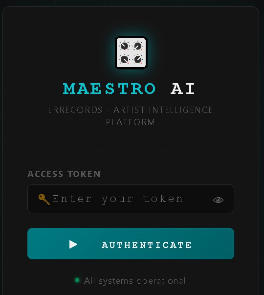
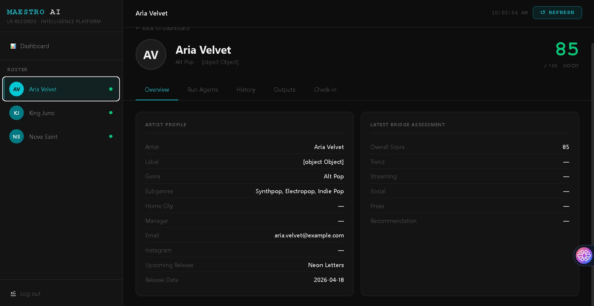
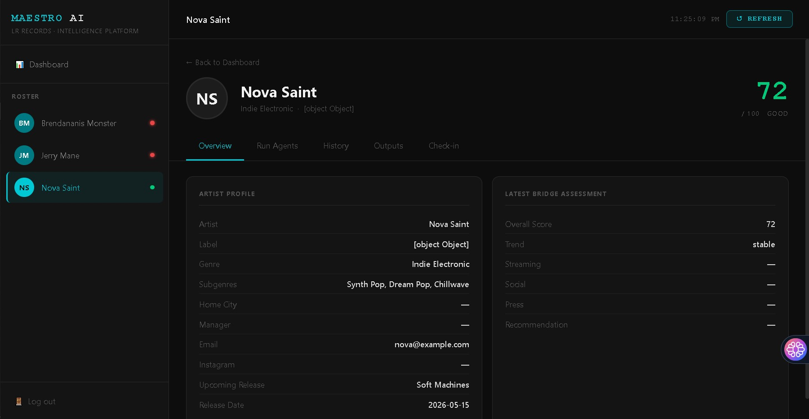
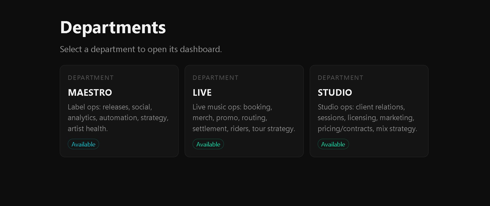
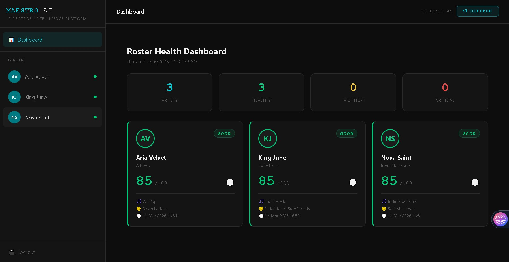

<p align="center">
  
</p>

# 🎼 Maestro AI — Multi-Agent Business OS for Music Labels

**A powerful, extensible, open-source platform that automates and streamlines operations for modern independent labels, studios, and music organizations using multi-agent AI orchestration.**

[](LICENSE)
[](https://github.com/lrrecords/maestro-ai/releases)
[](https://github.com/lrrecords/maestro-ai/actions)

---

## 🚀 Overview

Maestro AI brings together specialized AI agents—each handling real music business tasks—under a unified, modular web dashboard. Built for working labels and teams, Maestro AI orchestrates artist management, studio production, live event logistics, and platform operations in one extensible system.

**No demo fluff—deployed by working indie labels.**

---

## 🏛️ Platform Architecture

- **Department Hub:** Central landing page after login. Navigate between departments (Label, Studio, Live, Platform Ops) with ease.
- **Flask + Modular Blueprints:** Each department is a self-contained module with its agents, routing, and templates.
- **Agent Registry:** Python-driven framework for pluggable, composable agent logic per business domain.
- **Live Dashboards:** Browser-based dashboard for real-time agent orchestration, workflow viz, and data inspection.

---

## ✨ Key Features

- Unified navigation and department hub
- Modular, extensible multi-agent system
- Automated artist analytics, release checklists, content planning, and more
- Web-based control panel: run, monitor, and review any agent or pipeline
- Live output streaming and workflow visualization
- No cloud dependency: runs fully local (or integrates with Anthropic/Ollama for model inference)
- Health monitoring for core platform services

---

## 🖼️ Screenshots

<<<<<<< HEAD










=======

## 🏢 Departments & Agents

| Department     | Description / Agents                                                       |
|----------------|---------------------------------------------------------------------------|
| **Label**      | Core artist and release operations<br>_Agents:_ ATLAS, VINYL, ECHO, FORGE, BRIDGE, SAGE |
| **Studio**     | Recording, creative, and production ops<br>_Agents:_ CLIENT, CRAFT, LLM, MIX, RATE, SCHEMA, SESSION, SIGNAL, SOUND |
| **Live**       | Performance and tour management<br>_Agents:_ BOOK, MERCH, PROMO, RIDER, ROUTE, SCHEMA, SETTLE, TOUR |
| **Platform Ops** | Infra/config, model tuning, system health monitoring                     |

_Switch between departments from the Hub. Each dashboard includes agents and real-time data views._

---

## 🗂️ Project Structure

```
maestro-ai/
├── dashboard/           # Main Flask app, blueprints, route logic
├── scripts/             # CLI tools and pipeline runners
├── templates/           # Jinja HTML templates (modular per department)
├── static/              # CSS/JS for dashboards
├── core/                # Agent base classes, runners, utils
├── data/                # Artist records, analytics, manifest/logs
├── docs/assets/         # All screenshots and documentation images
├── requirements.txt
├── ...
```

---

## ⚡ Quick Start

1. **Clone & Set Up**

    ```bash
    git clone https://github.com/lrrecords/maestro-ai.git
    cd maestro-ai
    python -m venv venv
    source venv/bin/activate        # or venv\Scripts\activate on Windows
    pip install -r requirements.txt
    ```

2. **Configure Environment**

    ```
    cp .env.example .env
    # Edit .env for Anthropic (cloud) or Ollama (fast, local)
    ```

    _See below for full configuration._

3. **Launch Dashboard**

    ```bash
    python scripts/web_app.py
    # Visit http://127.0.0.1:8080
    ```

4. **Or Use CLI**

    ```bash
    python scripts/maestro.py <agent> "Artist Name"
    ```

---

## ⚙️ Configuration (.env example)

- `LLM_PROVIDER` = anthropic | ollama
- `ANTHROPIC_API_KEY` (if using Anthropic)
- `OLLAMA_BASE_URL`, `OLLAMA_MODEL` (if using Ollama – free, local)
- `MAESTRO_TOKEN` = your secure dashboard token
- `PORT` = dashboard port (default: 8080)
- _See `.env.example` for all available settings_

_Ollama runs on Mac, Linux, or Windows and requires downloading a model._

---

## 🧬 Typical Workflows

- **Run a pipeline for one artist:**  
  `python scripts/maestro.py full "Artist Name"`

- **Review all artists in dashboard:**  
  Launch the web app and login; navigate between Label/Studio/Live for roster-wide ops.

- **Automate n8n/No-code integrations:**  
  Webhook support for agent event triggers.

---

## ⚠️ Known Issues & Limitations

- Artist details on the Label dashboard: click-through for profile is temporarily broken.
- Advanced analytics visualizations are WIP.
- Some agents remain stubs or MVPs—follow the roadmap for next milestones.

---

## 🗺️ Roadmap (2026+)

- [x] Modular department system (Hub & navigation)
- [x] Platform Ops (model config, health monitoring)
- [x] Pluggable agent registry
- [x] Ollama/Anthropic support for LLMs
- [ ] Advanced analytics & reporting
- [ ] Plugin/extension API for custom agents
- [ ] Improved onboarding & demo mode
- [ ] Containerized/Docker deployment
- [ ] Multi-label & SaaS onboarding

---

## 🤝 Contributing

We welcome PRs! See [`CONTRIBUTING.md`](CONTRIBUTING.md).  
Please don’t commit real artist/label data or any credentials.

---

## 📖 More Information

- [RELEASES.md](./RELEASES.md) — detailed changelog & migration notes
- [LICENSE](./LICENSE)
- [Quickstart Guide](./docs/quickstart.md) (coming soon)

---

## 🏷️ License

MIT License © [LRRecords](https://github.com/lrrecords), 2026

---