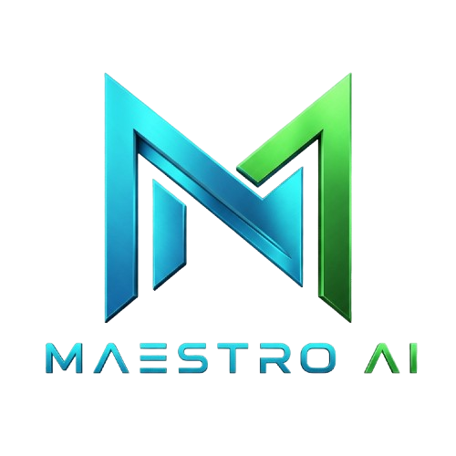

<p align="center">
  
</p>
<h1 align="center">🎼 Maestro AI — The AI Operating System for Independent Music</h1>

[](LICENSE)
[](https://github.com/lrrecords/maestro-ai/releases)


**A modular, production-ready, open-source platform for independent labels, studios, and live teams, powered by multi-agent AI orchestration.**

> **Branding/Trademark Notice**
> Maestro AI and LRRecords branding may not be used for proprietary or premium features without written permission. The open core is MIT licensed; premium code may have additional restrictions.

## 🚀 What is Maestro AI?

Maestro AI brings specialized agents for Label, Studio, Live, and Platform Ops into one web dashboard and mission workflow system. It is designed for real operator workflows, not just demos, with auth, job persistence, and production deployment paths already in place.

## 🆕 Current State — v1.5.0 (July 2026)

Maestro AI is live and operating at [LRRecords](https://lrrecords.com.au) in Rockingham, Western Australia.

**Working now:**
- CEO Command Centre with mission orchestration and approval queue
- 25+ agents across Label, Studio, Live, and Platform Ops departments
- Redis-backed persistent job store
- Role-based permissions (CEO / admin / user)
- Swagger/OpenAPI documentation
- Multi-provider LLM support: Ollama, Anthropic, OpenAI/ChatGPT, DeepSeek, Gemini, and OpenAI-compatible endpoints
- Premium agents including LEDGER, SAGE Daily Brief, FOCUS, and multi-label onboarding
- SCRIBE content pipeline at `agents/label/scribe/`
- Container deployment support via Dockerfile + Procfile + Railway

**Railway deployment and smoke testing:**
- Canonical launch path: `Procfile -> app.py -> dashboard.app:app`
- Live smoke runner: `python scripts/maestro_railway_smoke.py --base-url https://maestro-ai.up.railway.app`
- Add `--login-token <token>` for authenticated checks when you have a test token

## ⚡ Quick Start (Self-Host)

1. **Clone and install**

   ```bash
   git clone https://github.com/lrrecords/maestro-ai.git
   cd maestro-ai
   python -m venv venv
   # macOS/Linux
   source venv/bin/activate
   # Windows PowerShell
   # .\venv\Scripts\Activate.ps1
   pip install -r requirements.txt
   ```

2. **Create your environment file**

   ```bash
   # macOS/Linux
   cp .env.example .env
   # Windows PowerShell
   # Copy-Item .env.example .env
   ```

3. **Set minimum required env vars in `.env`**

   ```env
   MAESTRO_TOKEN=replace-with-strong-token
   WEBHOOK_SECRET=replace-with-strong-secret
   SECRET_KEY=replace-with-random-secret-key

   # Choose one LLM provider
   LLM_PROVIDER=anthropic
   ANTHROPIC_API_KEY=sk-...
   # or
   # LLM_PROVIDER=ollama
   # OLLAMA_BASE_URL=http://127.0.0.1:11434
   # OLLAMA_MODEL=qwen2.5:3b
   # or
   # LLM_PROVIDER=openai
   # OPENAI_API_KEY=sk-...
   # OPENAI_MODEL=gpt-4o-mini
   # or
   # LLM_PROVIDER=deepseek
   # DEEPSEEK_API_KEY=...
   # DEEPSEEK_MODEL=deepseek-chat
   # or
   # LLM_PROVIDER=gemini
   # GEMINI_API_KEY=...
   # GEMINI_MODEL=gemini-2.5-flash
   # or
   # LLM_PROVIDER=openai_compatible
   # LLM_API_BASE_URL=https://your-endpoint/v1
   # LLM_API_KEY=...
   # LLM_MODEL=gpt-4o-mini
   ```

   Full provider setup matrix: [docs/LLM_PROVIDER_SETUP_MATRIX.md](docs/LLM_PROVIDER_SETUP_MATRIX.md)

4. **Run the dashboard**

   ```bash
   python dashboard/app.py
   ```

5. **Open** `http://127.0.0.1:8080` and authenticate with your configured token.

**Optional container run:**

```bash
docker build -t maestro-ai .
docker run --env-file .env -p 8080:8080 maestro-ai
```

Playwright (`playwright install chromium`) is optional and only needed for browser automation workflows.

## 🌐 Hosted Access (MVP)

- Live URL: https://maestro-ai.up.railway.app
- Onboarding flow:
1. Share live URL
2. Share login token over a separate secure channel
3. Start from `/hub`, then run one starter flow from `/agents`

Operator guide: [docs/LIVE_USER_ONBOARDING.md](docs/LIVE_USER_ONBOARDING.md)

## 🏛️ Architecture Overview

- **Department Hub:** Unified landing page across Label, Studio, Live, and Platform Ops
- **Flask modular blueprints:** Department-specific routing, templates, and workflows
- **Agent registry:** Pluggable Python agents and crews for domain tasks
- **Persistent operations:** Redis-backed job store and approval state management
- **Web control plane:** Real-time run/monitor/review flows with dashboard UX

## 🔐 Auth & Security

All dashboard/API routes and inbound webhooks are authenticated.

### Dashboard/API authentication

- Session login for browser users
- Token auth for API clients via either header:
  - `X-MAESTRO-TOKEN: <token>`
  - `Authorization: Bearer <token>`

### Webhook authentication

All `/webhook/*` endpoints require either:
- `X-WEBHOOK-SECRET: <secret>`
- `Authorization: Bearer <secret>`

### Required production env vars

- `MAESTRO_TOKEN`
- `WEBHOOK_SECRET` (required when using inbound webhooks)
- `SECRET_KEY`

See [docs/quickstart.md](docs/quickstart.md) and `.env.example` for full configuration options.

## ✨ Key Features

- Unified navigation and department hub
- Modular multi-agent framework for music operations
- CEO approval queue for protected actions
- Mission orchestration and workflow execution
- Redis-backed persistent job history
- Live dashboards for run tracking and output review
- n8n/webhook integration support
- Local-first mode with optional cloud LLM support

## 🟡 FOCUS Brief API & Widget (v1.5.0)

The FOCUS Brief is a CEO dashboard widget and API endpoint that aggregates operational signals (approvals, missions, shows, and more) from configurable data sources with optional AI summarization.

### Features

- Configurable data sources in `dashboard/label/focus_config.py`
- Endpoint: `GET /label/api/focus/brief`
- JSON response with summary + `headline`
- Rate limiting (default 10 requests/minute per IP via Flask-Limiter)
- Widget states: loading, error, and success headline rendering

### Configuration Example

```python
# dashboard/label/focus_config.py
FOCUS_DATA_SOURCES = [
    {"name": "approvals", "loader": "crews.base_crew.get_pending_approvals", "summary_key": "approvals"},
    {"name": "missions", "path": "data/missions/missions.json", "summary_key": "missions"},
    {"name": "upcoming_shows", "path": "live/data/shows.json", "summary_key": "upcoming_shows"},
]
```

### Testing

- Focus tests: `pytest tests/test_focus_brief.py`

## 📝 SCRIBE Agent (Blog + Social Content)

SCRIBE is Maestro's content strategy and publishing pipeline.

### SCRIBE environment setup

Minimum LLM setup:

```env
LLM_PROVIDER=anthropic
ANTHROPIC_API_KEY=sk-...
# or use Ollama locally
# OLLAMA_BASE_URL=http://127.0.0.1:11434
# OLLAMA_MODEL=qwen2.5:3b
```

Optional n8n publish dispatch:

```env
SCRIBE_N8N_WEBHOOK_URL=http://localhost:5678/webhook/scribe-approved
```

Optional social/blog integrations:

```env
EASYFUNNELS_API_KEY=...
EASYFUNNELS_BLOG_ENDPOINT=...
GOOGLE_BUSINESS_PROFILE_ACCOUNT_ID=...
GOOGLE_BUSINESS_PROFILE_LOCATION_ID=...
SCRIBE_SOCIAL_X_BEARER_TOKEN=...
SCRIBE_SOCIAL_FACEBOOK_PAGE_TOKEN=...
SCRIBE_SOCIAL_INSTAGRAM_ACCESS_TOKEN=...
```

See `.env.example` for complete variable coverage.

### SCRIBE usage

- Dashboard: `/label/scribe/`
- Approval queue: `/label/scribe/approvals`
- Edit job: `/label/scribe/edit/<job_id>`
- Admin utilities:
  - `GET /label/scribe/admin/normalize-propose-topics`
  - `GET /label/scribe/admin/export-jobs`

### SCRIBE reference files

| File | Purpose |
|------|---------|
| `dashboard/label/scribe.py` | Flask routes and workflow logic |
| `agents/label/scribe/scribe_agent.py` | SCRIBE agent implementation |
| `core/job_store.py` | Redis-backed persistent job store |
| `templates/label/scribe_dashboard.html` | SCRIBE dashboard UI |
| `templates/label/scribe_approvals.html` | Approval queue UI |
| `templates/label/scribe_edit_approval.html` | Structured editor UI |
| `n8n/workflows/scribe_blog_publish.json` | n8n workflow stub |

## 🎭 LIVE Dashboard

The LIVE dashboard at `/live/` provides operational tables (Shows, Tours) and modal runners for LIVE agents (BOOK, ROUTE, SETTLE, MERCH, PROMO, RIDER, TOUR).

Agent runs write audit outputs to `live/data/<agent>/...` and do not modify schedule tables until an explicit Apply action is used.

Primary data files:
- `live/data/shows.json`
- `live/data/tours.json`
- `live/data/booking_history.json`

## 🗺️ Roadmap (2026+)

- [x] Modular department system
- [x] Platform Ops and health monitoring
- [x] Pluggable agent registry
- [x] Ollama/Anthropic support
- [x] Containerized deployment
- [ ] Advanced analytics and reporting
- [ ] Plugin/extension API for custom agents
- [ ] SaaS-grade multi-label onboarding

## ⚠️ Known Issues

- Onboarding wizard UI is not yet shipped (multi-label onboarding currently outputs JSON checklist)
- SAGE requires an available LLM provider; FOCUS can run with fallback behavior
- Docker healthcheck relies on curl availability in customized base images
- Demo artist data is intentionally minimal
- CI freshness checks require regular updates to selected artifacts

## 🤝 Contributing

We welcome pull requests. See [CONTRIBUTING.md](CONTRIBUTING.md).

Please do not commit real artist data, credentials, or private tokens.

Harness workflow reference: [HARNESS_ENGINEERING_WORKFLOW.md](HARNESS_ENGINEERING_WORKFLOW.md)

## 📚 Documentation

- [docs/quickstart.md](docs/quickstart.md)
- [docs/LIVE_USER_ONBOARDING.md](docs/LIVE_USER_ONBOARDING.md)
- [docs/IMPLEMENTATION_GUIDE.md](docs/IMPLEMENTATION_GUIDE.md)
- [docs/mission_briefs_examples.md](docs/mission_briefs_examples.md)
- [docs/EXTENDING.md](docs/EXTENDING.md)
- [RELEASES.md](RELEASES.md)
- [RELEASE.md](RELEASE.md)

## 🏷️ License

This project is Open Core compliant. Premium/proprietary features are separated and may be disabled via `.env`.

MIT License © [LRRecords](https://github.com/lrrecords), 2026

