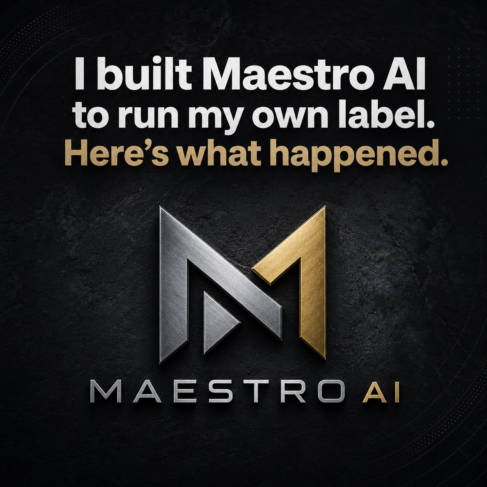
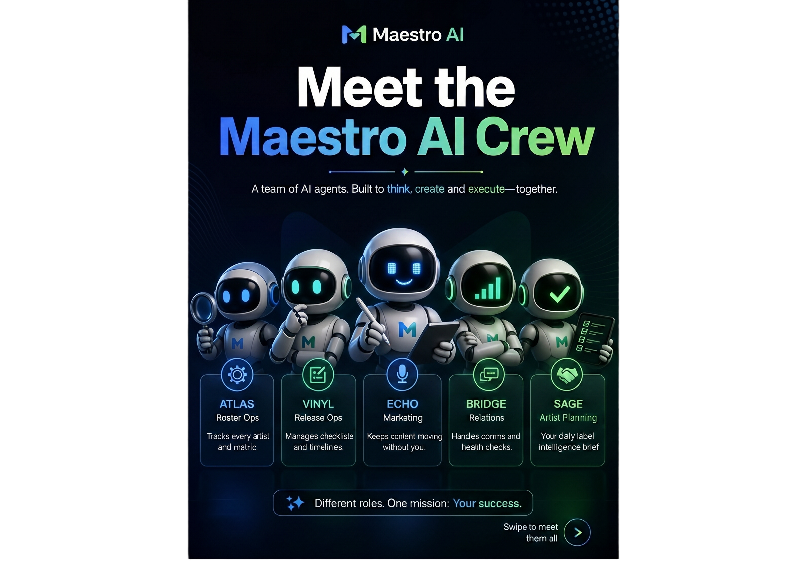
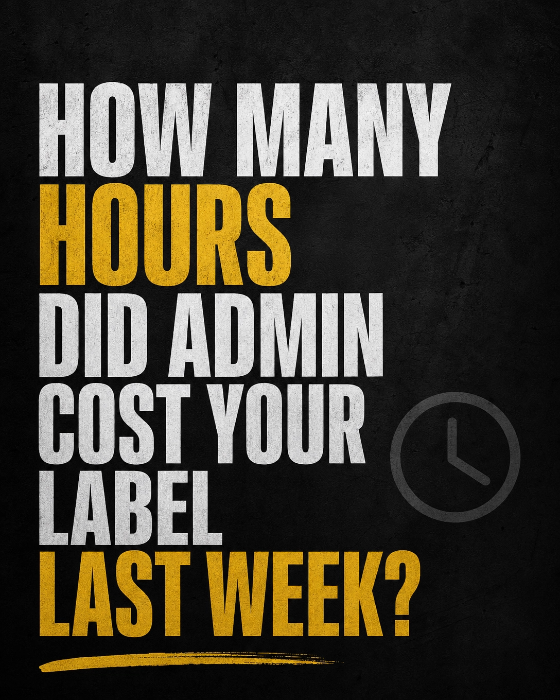
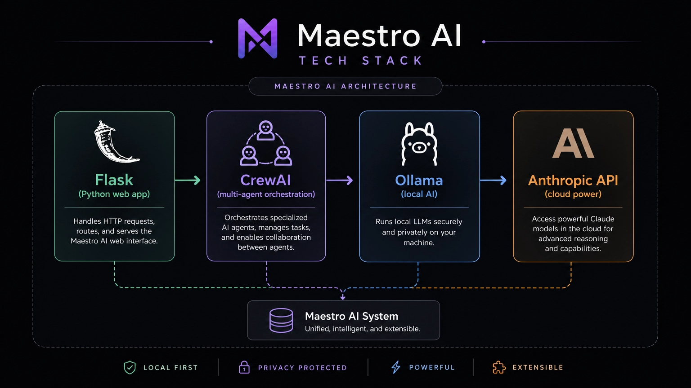
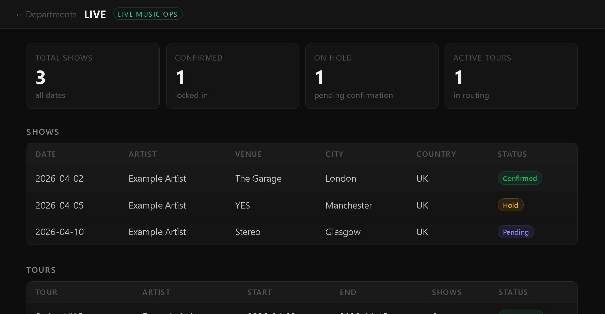
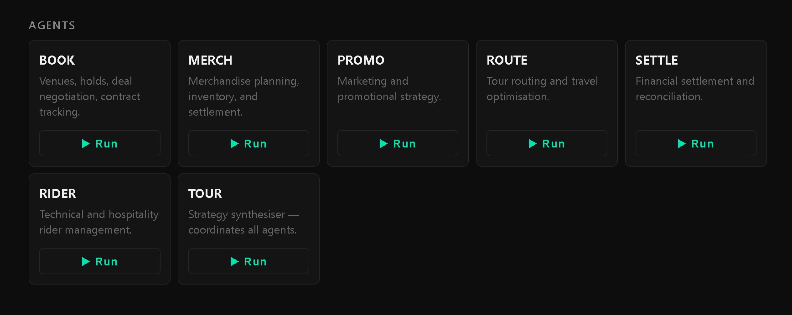
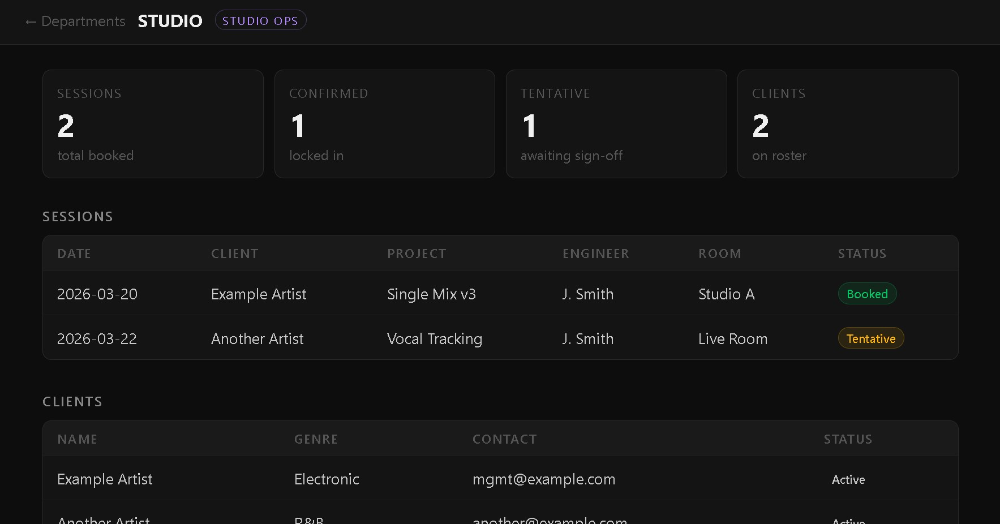
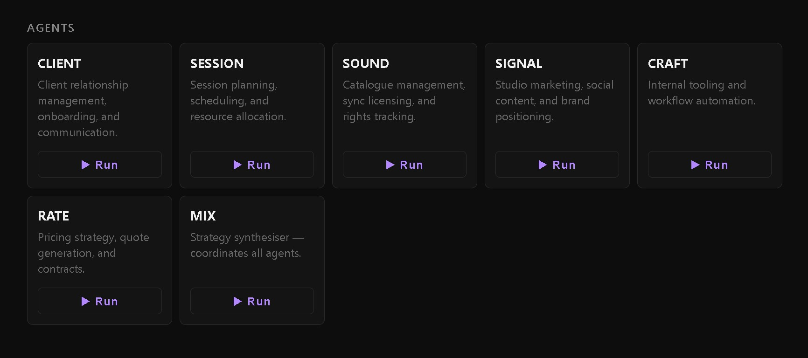

# 🎼 Maestro AI — Full Marketing Plan
### Audience-Segmented, Channel-Mapped, Launch-Ready
> April 2026 | Complements: `maestro_ai_social_series.md` | By: Brett @ LRRecords

---

## Why Maestro Exists (and What It’s Not)

In 2026, the music industry is buzzing with questions—and real concerns—about AI’s impact on creativity, connection, and copyright. Many fear that AI tools are here to replace human artistry, automate away the soul of music, or blur the lines of ownership and originality. Products like SUNO and MIDJOURNEY have sparked debate by generating music and art with little or no human input.

**Maestro AI is not that.**  
Maestro was built with a different philosophy: to empower, not replace, the humans at the heart of music. Maestro does not generate music, lyrics, or art. It does not try to mimic or automate the creative spark. Instead, Maestro is designed to give music professionals, artists, and teams more time and bandwidth to do what only humans can—create, connect, and inspire.

**What Maestro Does:**  
- Automates the admin, business, and operational grind—so you can spend more time making music and less time on paperwork.
- Handles approvals, scheduling, communications, and workflows, freeing you to focus on your craft and your community.
- Respects the value of human-to-human connection, collaboration, and creativity.

**What Maestro Will Never Do:**  
- Generate music or art in place of humans.
- Replace the creative process or the relationships that make music meaningful.
- Compromise on copyright, ownership, or artistic integrity.

**Maestro is the tool for music professionals who want to protect and amplify human creativity—not automate it away.**  
By design, Maestro leaves the art to you. It’s here to handle the rest.

---

## ⚡ DO TONIGHT (30–60 min, max)

If you only do one thing tonight, do this stack in order:

| # | Action | Where | Time |
|---|---|---|---|
| 1 | Post **Founder Story** (Section 2A below) | Instagram static | 5 min |
| 2 | Send **Launch Email** (Section 3A below) | Email list | 10 min |
| 3 | Post **GitHub README update note** (Section 5A) | GitHub Discussions or README | 5 min |
| 4 | Send **Artist DM** (Section 4A below) | WhatsApp/SMS to your roster | 5 min |
| 5 | Commit + push to GitHub | Terminal | 5 min |

That's it. Everything else below is the full plan to execute over the coming weeks.

---

## 1. Audience Segments & What They Need to Hear

| Segment | Core Need | Tone | Primary Channel |
|---|---|---|---|
| **Social Followers** (music/tech curious) | "Is this real? Is it for me?" | Exciting, visual, human-first | Instagram / TikTok |
| **Email Subscribers** (warm, opted-in) | "What does this mean for me specifically?" | Direct, personal, honest, reassuring | Email newsletter |
| **Label Artists** (your roster) | "Does this change how we work together?" | Reassuring, creative, personal, human-centric | DM / WhatsApp |
| **Music Industry End Users** (potential buyers) | "Does this solve a real problem I have?" | Problem-first, credibility, demo, human-in-the-loop | Blog / LinkedIn / GitHub |
| **AI Builder Community** | "Is this architecturally interesting?" | Technical, peer-to-peer, open, ethical | Discord / GitHub / Reddit |

---

## 2. SOCIAL MEDIA — Complement to Existing Series

Your existing 10-post series covers: agents intro, CEO Command Centre, live ops, studio ops, open source, before/after, and demo CTA.

**What's missing from the series:** the founder voice, the "why it exists," the behind-the-scenes build journey, and community/UGC hooks.  
**What’s now essential:** clarity that Maestro is not generative AI, but a tool to protect and empower human creativity.

These 8 posts fill those gaps. Interleave them with the existing 10 as you see fit.

---

---

## ⚡ DO TONIGHT (30–60 min, max)

If you only do one thing tonight, do this stack in order:

| # | Action | Where | Time |
|---|---|---|---|
| 1 | Post **Founder Story** (Section 2A below) | Instagram static | 5 min |
| 2 | Send **Launch Email** (Section 3A below) | Email list | 10 min |
| 3 | Post **GitHub README update note** (Section 5A) | GitHub Discussions or README | 5 min |
| 4 | Send **Artist DM** (Section 4A below) | WhatsApp/SMS to your roster | 5 min |
| 5 | Commit + push to GitHub | Terminal | 5 min |

That's it. Everything else below is the full plan to execute over the coming weeks.

---

## 1. Audience Segments & What They Need to Hear

| Segment | Core Need | Tone | Primary Channel |
|---|---|---|---|
| **Social Followers** (music/tech curious) | "Is this real? Is it for me?" | Exciting, visual, human | Instagram / TikTok |
| **Email Subscribers** (warm, opted-in) | "What does this mean for me specifically?" | Direct, personal, honest | Email newsletter |
| **Label Artists** (your roster) | "Does this change how we work together?" | Reassuring, creative, personal | DM / WhatsApp |
| **Music Industry End Users** (potential buyers) | "Does this solve a real problem I have?" | Problem-first, credibility, demo | Blog / LinkedIn / GitHub |
| **AI Builder Community** | "Is this architecturally interesting?" | Technical, peer-to-peer, open | Discord / GitHub / Reddit |

---

## 2. SOCIAL MEDIA — Complement to Existing Series

Your existing 10-post series covers: agents intro, CEO Command Centre, live ops, studio ops, open source, before/after, and demo CTA.

**What's missing from the series:** the founder voice, the "why it exists," the behind-the-scenes build journey, and community/UGC hooks.

These 8 posts fill those gaps. Interleave them with the existing 10 as you see fit.

---


### 2A. FOUNDER STORY — Tonight's Post (Static or Short Reel)



**Hook:**
I built Maestro AI to run my own label. Here's what happened.

**Body:**
Running LRRecords meant I was spending more time on admin than on music. Approvals, release checklists, booking, session tracking, artist comms — all of it. I built Maestro AI to automate the grind for us first. But Maestro doesn’t make music for you—it gives you back the time to make more of your own. Now we're releasing it so other labels and studios don't have to start from scratch. It's open source. It runs locally. It's built by a label, for labels. This is where we are — and where we're heading.

**CTA:**
Follow to watch it being built. Link in bio for the full story.

**Hashtags:**
#buildinpublic #indielabel #musictech #maestroai #musicops #lrrecords #opensource #musicbusiness #humanfirst

**Format:** Static image (logo + 1-sentence hook overlay) or 30-sec talking head reel

---


### 2B. BUILD IN PUBLIC — Week 1


**Hook:**
I'm building an AI operating system for music labels. In public. No VC. No roadmap deck. Just code.

**Body:**
Maestro AI is what happens when a label owner gets fed up with bad tools and decides to build their own. Every week I'm shipping new agents, dashboards, and automations — all open source, all built to solve real problems at LRRecords first. This isn’t another AI that tries to write your next song. Maestro handles the business, so you can handle the art. If you're curious about AI, music business, or just like watching real things get built — you're in the right place.

**CTA:**
Comment "BUILD" if you want weekly updates on what we're shipping.

**Format:** Reel (screen recording of dashboard + voiceover)

---


### 2C. THE AGENT ROSTER VISUAL — Carousel



**Hook:**
Your label's dream team doesn't need a salary.

**Slide 1:** "Meet the Maestro AI Crew"
**Slide 2:** ATLAS — "Knows every artist. Tracks every metric."
**Slide 3:** VINYL — "Release checklists that never miss a step."
**Slide 4:** ECHO — "Keeps your marketing moving without you."
**Slide 5:** BRIDGE — "Handles your comms. Nothing leaves without your OK."
**Slide 6:** BOOK — "Books sessions and tours. No emails required."
**Slide 7:** SAGE — "Your daily label intelligence brief. Every morning."
**Slide 8:** "All agents. One dashboard. Your label."
**Slide 9:** "Maestro agents don’t create music—they create space for you to do it."

**CTA:**
Which agent would save you the most time? Comment below.

**Format:** Carousel — dark background, agent name + icon + one-liner per slide

---


### 2D. THE REAL COST POST — Static



**Hook:**
How many hours did admin cost your label last week?

**Body:**
Let's be honest. The average indie label spends 15–20 hours a week on tasks that have nothing to do with music. Emails, scheduling, chasing invoices, updating spreadsheets, approving content. That's half a working week. Maestro AI was built to give those hours back — to your creativity, your artists, and your life outside work. Maestro is about protecting your creative time, not replacing it.

**CTA:**
What would you do with 10 extra hours a week? Drop it in the comments.

**Format:** Static — bold text on clean background. Provokes engagement.

---


### 2E. STACK TRANSPARENCY — For Tech-Curious Followers



**Hook:**
What's actually running under the hood of Maestro AI?

**Body:**
No mystery. No black box. Maestro AI is built on: Flask (Python web app), CrewAI (multi-agent orchestration), Ollama (local AI — your data stays on your machine), Anthropic API (Claude, for when you want cloud power). Open source on GitHub. No subscription. No lock-in. No generative AI. No black box music. Just tools to help you run your business, your way.

**CTA:**
Star the repo on GitHub → [github.com/lrrecords/maestro-ai]

**Format:** Carousel — tech stack diagram, one tool per slide with brief explanation

---

### 2F. ROADMAP TEASE — Anticipation Builder

**Hook:**
Here's what's coming to Maestro AI in 2026.

**Body:**
We're just getting started. On the roadmap: advanced analytics across your entire roster, a plugin API for custom agents, Docker deployment, and multi-label SaaS onboarding. Plus some things we haven't announced yet. We're building this for real labels with real problems — so the roadmap is shaped by what actually matters in the trenches, not what looks good on a slide. And always: Maestro will never generate music or art. It’s here to support the humans who do.

**CTA:**
What would you build first? Tell us in comments and we'll add it to the list.

**Format:** Carousel — roadmap timeline visual, tick/pending style

---

### 2G. COMMUNITY CHALLENGE — Engagement Driver

**Hook:**
What's the #1 task killing your creative time?

**Body:**
We're building new Maestro AI agents and we want to solve real problems. If you run a label, studio, or manage artists — what's the one thing you wish was automated? Drop it below. The top answer from this post becomes the next agent we build. Seriously. And don’t worry—Maestro will never touch your creative process, only the admin.

**CTA:**
Comment your biggest time killer. We're reading every reply.

**Format:** Static or Reel — genuine community question, no sell

---


### 2H. RESULTS POST — Proof (Use when you have a win to share)


**Hook:**
This week Maestro AI saved us [X hours] at LRRecords. Here's exactly what it did.

**Body:**
[Fill in: specific example. e.g. "SAGE briefed me in 2 minutes on 3 artists who needed attention. VINYL flagged a release checklist item I'd missed. BOOK queued 2 session confirmations that would have taken 30 emails."] That's the real product. Not the demo. The daily unglamorous time-saving that adds up to getting your life back. Maestro didn’t write a song for us—it made sure we had more time to write our own.

**CTA:**
Want to see how it works for your label? Link in bio.

**Format:** Reel or static — real number, real story. Authenticity over polish.

---


## 3. EMAIL NEWSLETTER — Audience: Warm Subscribers

### 3A. LAUNCH ANNOUNCEMENT — Send Tonight

**Subject:** Something we've been building at LRRecords (and why it’s not generative AI)

**Preview text:** Built for music people, not to replace them. Maestro is not generative AI.

---

Hey [first name],

I want to share something we’ve been quietly building at LRRecords — and why it’s different from the AI tools you might be hearing about.

It’s called **Maestro AI**. And before anything else: Maestro does *not* generate music, lyrics, or art. It’s not here to replace artists, producers, or the creative process. Maestro is a tool to protect your creative time by automating the admin, business, and operational grind that gets in the way of making music.

Here’s why I built it:

*Why was I spending more time running the label than making music?*

Releases, approvals, session bookings, artist communications, tour planning, invoices — it all piles up. Every hour on admin is an hour not in the studio. Maestro was built to give those hours back to the humans who make the music.

**What Maestro Does:**
- Automates the admin, business, and operational grind—so you can spend more time making music and less time on paperwork.
- Handles approvals, scheduling, communications, and workflows, freeing you to focus on your craft and your community.
- Respects the value of human-to-human connection, collaboration, and creativity.

**What Maestro Will Never Do:**
- Generate music or art in place of humans.
- Replace the creative process or the relationships that make music meaningful.
- Compromise on copyright, ownership, or artistic integrity.


**The agents running at LRRecords right now:**


- **ATLAS** — artist roster and analytics
- **VINYL** — release planning and checklists
- **ECHO** — content and marketing automation
- **BRIDGE** — communications (nothing goes out without my approval)
- **BOOK** — session and tour bookings
- **SAGE** — daily intelligence brief so I know what matters every morning

It runs locally on our own server (your data stays yours), it’s open source, and it’s free to use.

We’ve just released **v1.4.0** — which includes the CEO Command Centre, full multi-agent orchestration, and a live dashboard for every department of the business.

**I’d love for you to:**
1. [Check it out on GitHub →](https://github.com/lrrecords/maestro-ai)
2. Star the repo if it looks interesting
3. Reply to this email and tell me — what’s the biggest ops headache you have in your music business?

We’re building the roadmap based on real problems from real people in the industry. Your answer matters.

More to come very soon.

Brett
Founder, LRRecords & Maestro AI
[lrrecords.com.au](https://lrrecords.com.au)

---

*P.S. If you know another label owner, studio manager, or artist manager who’s drowning in admin — forward this to them. Maestro was built for exactly that person. And just to be clear: Maestro will never generate music or art. That’s your job.*

---

### 3B. FOLLOW-UP EMAIL — Send 5–7 Days After 3A

**Subject:** What Maestro AI actually does (a real example — and what it never will)

**Preview text:** No slides. Just what happened this week at LRRecords. And a reminder: Maestro is not generative AI.

---

Hey [first name],

Last week I mentioned Maestro AI — the AI operating system we've built for LRRecords.

A few people replied asking: *"Okay, but what does it actually do day to day?"*

Fair question. Here's a real example from this week:

**Monday morning. I open the Maestro dashboard.**

SAGE (our intelligence agent) has already run overnight. It surfaces:
- One artist with a release deadline in 9 days and 3 checklist items still open
- A session booking request that came in via email — unactioned
- A content gap: ECHO flagged that one artist hasn't had a social post go out in 11 days

Without Maestro: I'd have found all of this across 4 different spreadsheets, 2 email inboxes, and a Notion page I probably haven't opened in a week.

With Maestro: It's all in one place, prioritised, and waiting for my decision. I approve, edit, or push back — and the agents handle the execution.

That's the real product. Not the AI hype. Just fewer dropped balls and more time for music.

**If you want to try it:**
[→ GitHub: github.com/lrrecords/maestro-ai](https://github.com/lrrecords/maestro-ai)
[→ Quick setup guide: lrrecords.com.au](https://lrrecords.com.au)

Still replying to every email that comes in — what's your biggest ops headache?

Brett

---

### 3C. FEATURE SPOTLIGHT — Ongoing Monthly Series

**Subject:** Maestro AI: [Agent Name] — what it does and why we built it

**Template — fill in [AGENT] and [STORY]:**

---

Hey [first name],

This month I want to walk you through one of Maestro's agents: **[AGENT NAME]**.

**The problem it solves:**
[2–3 sentences: what was breaking before this agent existed at LRRecords]

**What it actually does:**
[3–4 bullet points: specific tasks, what it automates, what it hands back to you for approval]

**The result:**
[1–2 sentences: time saved, mistake prevented, creative headspace recovered]

If you're curious how this could work for your label or studio, reply and let's chat.

Brett

---

## 4. LABEL ARTISTS — Your Roster

*These are people who work with you. They need reassurance + excitement, not a sales pitch.*

### 4A. PERSONAL DM/TEXT — Send Tonight

Use for WhatsApp or SMS. Keep it conversational and short.

---

Hey [Artist name] — wanted to give you a heads up on something we've been building at LRRecords.

We've launched Maestro AI — it's basically an AI system that runs a lot of the label ops behind the scenes. Release checklists, session bookings, your analytics — all automated.

For you it means: faster responses from us, nothing falling through the cracks on your releases, and I actually have more time to focus on your music.

It's early days but working well. I'll show you the dashboard next time we're in the studio. Just wanted you to know it's running in the background making things better.

More soon. 🎵

---

### 4B. ARTIST-FACING ONE-PAGER — PDF or Website Page

**Title:** How LRRecords uses Maestro AI to support your career

**Sections:**


**What it means for you as an artist:**
We use Maestro AI to manage the operational side of your career with us — release planning, session scheduling, analytics tracking, and communications. Maestro does not generate music or art, and never will. It’s not here to replace your creativity or automate the art. Maestro is here to make sure nothing slips through the cracks and you always know what's happening with your project, so you can focus on making music.


**Your data, your control:**
Maestro runs on our own servers. Your music, your data, and your information stay with us — not on some external cloud platform. Maestro is built to protect your creative work, not to use it for training or generation.

**What you'll notice:**
- Faster responses on bookings and release questions
- More consistent communication and updates
- Release checklists you can see and track
- Nothing missing from your project timeline


**What doesn't change:**
Our relationship. Maestro handles the admin so I can focus more on the creative partnership. The art always stays in human hands.

**Questions?**
Any time. Just message or email as usual.

---

## 5. MUSIC INDUSTRY END USERS — Potential Customers / Adopters

*These people have real ops problems. Lead with the problem. Credibility through specificity.*

### 5A. GITHUB README UPDATE — Do Tonight

Add this section near the top of README.md, after the intro paragraph:

```markdown
## 🆕 Current State — v1.4.0 (April 2026)

Maestro AI is live and running operations at [LRRecords](https://lrrecords.com.au) in Rockingham, Western Australia.

**What's working now:**
- CEO Command Centre with mission orchestration and approval queue
- 25+ agents across Label, Studio, Live, and Platform Ops departments
- Redis-backed persistent job store
- Role-based permissions (CEO / admin / user)
- Full Swagger/OpenAPI documentation
- Ollama (local, private) and Anthropic API (cloud) support

**What's coming:**
- LEDGER agent (financial tracking)
- SAGE Daily Brief (morning intelligence digest)
- FOCUS agent (CEO priority queue)
- Docker deployment to Railway
- Multi-label SaaS onboarding

If you're running an independent label, studio, or live music organisation and want to try Maestro — star the repo and open an issue. We're actively building from real-world feedback.
```

---


### 5B. BLOG POST / WEBSITE — "Why We Built Maestro AI"

**Publish on:** lrrecords.com.au/blog or as a Medium/Substack post

**Title:** Why I built an AI operating system for my music label — and why I open-sourced it (and what Maestro will never do)

---

**The problem was simple. The solution took months.**

When you run an independent music label, you wear every hat. A&R, marketing, operations, finance, artist relations, logistics. And somewhere in all of that — you're supposed to be making music.

The reality for most indie label owners is that operations consume 40–60% of working hours. Not creative work. Admin. Emails, spreadsheets, approval chains, release timelines, session scheduling, tour finances. All of it falling through the cracks because the tools built for music businesses were either too generic, too expensive, or too disconnected from how labels actually work.

I'm Brett, founder of LRRecords, an independent label and studio based in Rockingham, Western Australia. I built Maestro AI to solve this problem — first for myself, and now for every other music professional facing the same wall.

**What Maestro AI actually is (and what it’s not)**

Maestro AI is a multi-agent business operating system. Not a chatbot. Not a productivity plugin. And absolutely not generative AI. Maestro does not generate music, lyrics, or art. It does not try to automate or replace the creative process. Instead, Maestro is a system of specialised AI agents — each one designed for a specific function of a music business — operating under a unified dashboard with a human (you) in the loop for every meaningful decision.

**What Maestro Will Never Do:**
- Generate music or art in place of humans
- Replace the creative process or the relationships that make music meaningful
- Compromise on copyright, ownership, or artistic integrity

The agents handle the execution. You handle the strategy and the creativity.


Here's what's running at LRRecords today:

**Label Department:**


**Live Department:**



**Studio Department:**



**Run Agents:**


**Checkin Example:**


*Label operations:* ATLAS (roster and analytics), VINYL (release planning), ECHO (content and marketing), BRIDGE (communications and outreach), FORGE (brand and creative), SAGE (daily intelligence briefing)

*Studio operations:* SESSION, CLIENT, SOUND, SIGNAL, CRAFT, RATE, MIX — covering every aspect of recording operations from booking to delivery.

*Live operations:* BOOK (tour and session booking), ROUTE (logistics), SETTLE (financial reconciliation), MERCH, PROMO, RIDER, TOUR.

*Platform Ops:* Model configuration, health monitoring, service management.

Everything runs through a web dashboard. The CEO approval queue means nothing goes out — no email, no post, no financial action — without explicit sign-off. Maestro is built around a human-in-the-loop model: you’re always in control, and the art always stays in human hands.

**Why open source?**

Because music tech has spent 20 years building tools for major labels and ignoring independent operators. I wanted to change that. Maestro AI is MIT licensed, free to self-host, and built to be extended. Your data stays on your infrastructure. No subscription. No vendor lock-in.

The code is on GitHub: [github.com/lrrecords/maestro-ai](https://github.com/lrrecords/maestro-ai)

**Where we're heading**

Maestro v1.4.0 is production-ready. The roadmap for 2026 includes: advanced analytics, a plugin API for custom agents, Docker deployment, and eventually a hosted SaaS option for labels that don't want to self-host.

But the foundation — autonomous agents, human approval loops, and a dashboard that tells you what matters every morning — that's built and working.


**Demo Artists:**


**If you're a label owner, studio manager, or artist manager** drowning in admin: this was built for you. Star the repo, open an issue, or reach out directly. We're building from real feedback, from real people in the industry.

[Try Maestro AI →](https://github.com/lrrecords/maestro-ai)

---

v1.4.0 is live and running operations at LRRecords right now.

### 5C. LINKEDIN POST — Professional / Industry Network

**For Brett's personal LinkedIn or LRRecords company page**

---

After months of building, I'm ready to talk about what we've been working on at LRRecords.

**Maestro AI** — an open-source, multi-agent business operating system built specifically for independent music labels, studios, and live music organisations.

The why: running a label means wearing every hat. A&R, ops, finance, marketing, logistics. The admin consumed half our week — time we should have been spending on music and artists.

So we built a system to handle it. And to be clear: Maestro does not generate music or art, and never will. It’s not generative AI. It’s a tool to automate the admin, not the art.

25+ specialised AI agents. A CEO approval queue so nothing goes out unreviewed. Department dashboards for Label, Studio, and Live operations. Runs locally on your own infrastructure — your data stays yours.

v1.4.0 is live and running operations at LRRecords right now.

We're open-sourcing it because music tech has spent too long building for majors and ignoring independent operators.

If you work in the music industry and ops is killing your creative time — I'd love to show you what we've built.

→ [github.com/lrrecords/maestro-ai](https://github.com/lrrecords/maestro-ai)
→ [lrrecords.com.au](https://lrrecords.com.au)

Happy to answer questions in the comments or via DM.

#musictech #indielabel #musicbusiness #AI #opensource #musicops #humanfirst

---

## 6. AI BUILDER COMMUNITY — Discord / Reddit / GitHub

*These are technical peers. Peer-to-peer tone. Lead with architecture and genuine curiosity, not marketing.*


### 6A. DISCORD MESSAGE — AI Agent / Multi-Agent Communities

**For: agent-builder focused Discord servers (e.g. CrewAI, multi-agent framework communities)**

---

Hey everyone — long-time lurker, first time posting here.

I've been building a multi-agent system for the past few months and just hit a stable release I'm comfortable sharing. It's called **Maestro AI** — a multi-agent business OS for independent music labels.

**Stack:** Flask · CrewAI · Ollama (Qwen2.5.8 locally) · Anthropic API fallback · Redis job store · n8n for automation

**What it does:** 25+ specialised agents across 4 business departments (Label, Studio, Live, Platform Ops). CEO approval queue for protected actions. Web dashboard with live agent output streaming. Role-based permissions. Full OpenAPI docs.

**What Maestro Will Never Do:**
- Generate music or art
- Replace the creative process
- Compromise on copyright or ownership

The agents handle the execution. The humans handle the art and the decisions. Maestro is not generative AI — it’s admin automation for music, not art automation.

**The interesting parts architecturally:**
- Agents are modular CrewAI crews, composable per workflow
- CEO Command Centre runs multi-step missions with stepwise execution and instant cancellation
- Redis-backed job store gives persistence across restarts
- Ollama/Anthropic are hot-swappable via env var — same agent logic, different inference backend

It's open source (MIT): [github.com/lrrecords/maestro-ai](https://github.com/lrrecords/maestro-ai)

Would love any feedback from folks who've worked with CrewAI at this scale. Specifically curious about: mission orchestration patterns, agent output validation, and how others are handling the local vs cloud inference tradeoff.

---


### 6B. REDDIT POST — r/LocalLLaMA, r/MachineLearning, or r/opensource

**Title:** Built a multi-agent business OS for music labels — open source, runs on Ollama, CrewAI orchestration (not generative AI)

**Body:**

I've been building Maestro AI — a multi-agent platform for independent music label operations. Just hit v1.4.0 and wanted to share with this community since the architecture might be interesting.

**Why it exists:** I run LRRecords, an independent label in Australia. Admin was consuming 40%+ of our week. Built Maestro to automate it — now open-sourcing so other labels can use it. Maestro does not generate music or art, and never will. It’s not generative AI — it’s admin automation for music businesses.

**Tech stack:**
- Flask + modular blueprints per business department
- CrewAI for multi-agent orchestration
- Ollama (Qwen2.5.8) for local inference — no data leaves the machine
- Anthropic API as optional cloud fallback
- Redis for persistent job/mission store
- n8n integration for webhook automation

**Interesting design decisions:**
- CEO approval queue: all "protected" actions (email sends, financial actions, public posts) require explicit human sign-off before execution
- Hot-swap inference backend: same agent logic, switch between Ollama and Anthropic via env var
- Stepwise mission runner: multi-step campaigns with instant cancellation at any step

**What Maestro Will Never Do:**
- Generate music or art
- Replace the creative process
- Compromise on copyright or ownership

**What I'm still working out:**
- Best patterns for agent output validation at scale
- How to handle mission state across long-running campaigns
- Multi-tenant architecture for eventual SaaS offering

GitHub: [github.com/lrrecords/maestro-ai](https://github.com/lrrecords/maestro-ai)

Happy to answer questions about the architecture. Also curious what patterns others are using for multi-agent orchestration with local models.

---

## 7. CONTENT CALENDAR — What to Post When

### Week 1 (This Week) — Launch

| Day | Channel | Content |
|---|---|---|
| Tonight | Instagram | Post 2A: Founder Story |
| Tonight | Email | 3A: Launch Announcement |
| Tonight | Artist DMs | 4A: Personal message to roster |
| Tonight | GitHub | 5A: README update |
| Day 2 | Discord | 6A: AI builder community post |
| Day 3 | LinkedIn | 5C: Professional post |
| Day 4 | Instagram | Existing Post 1 (from your series) |
| Day 5 | Instagram | Post 2B: Build in Public |

### Week 2 — Depth

| Day | Channel | Content |
|---|---|---|
| Day 8 | Blog | 5B: Why We Built Maestro AI |
| Day 9 | Instagram | Existing Post 2: Agent Roster |
| Day 10 | Instagram | Post 2C: Agent Roster Visual (carousel) |
| Day 11 | Email | 3B: Follow-up "What it actually does" |
| Day 12 | Reddit | 6B: Community post |
| Day 14 | Instagram | Existing Post 3: Built by a label |

### Week 3–4 — Engagement & Community

| Day | Channel | Content |
|---|---|---|
| Day 15 | Instagram | Post 2G: Community Challenge |
| Day 17 | Instagram | Existing Post 4: CEO Command Centre |
| Day 19 | Email | 3C: Agent spotlight (pick SAGE or VINYL) |
| Day 21 | Instagram | Post 2D: The Real Cost |
| Day 23 | Instagram | Existing Post 5: Live Ops |
| Day 28 | Instagram | Post 2H: Results post (fill in real win) |


### Ongoing — Monthly Rhythm

- **1 email newsletter/month** — agent spotlight or build update
- **2–3 Instagram posts/week** — mix of existing series, new content above, and real behind-the-scenes
- **1 blog post/month** — technical or founder perspective
- **Community posts** — whenever you ship something meaningful

---

## Maestro AI Service Tiers


*Visual summary of Maestro AI's available service tiers and offerings.*

---

## 8. MESSAGING HIERARCHY — What Maestro Is, At Every Level

Use these consistently across all channels. Same story, different depth.


**One sentence (bio, tagline):**
> Maestro AI is the AI operating system for independent music labels — built to automate admin, not art.

**Two sentences (post caption, quick pitch):**
> Maestro AI automates label, studio, and live music operations with specialised AI agents. It’s not generative AI — Maestro never creates music or art, only frees up your time to do it. Built by LRRecords — runs locally, open source, free.

**One paragraph (email intro, blog opener, LinkedIn):**
> Maestro AI is a multi-agent business operating system built specifically for independent music labels, studios, and live music organisations. It combines 25+ specialised AI agents with a CEO approval queue and department dashboards — automating the admin so music professionals can focus on what matters. Maestro never generates music or art, and never will. Built at LRRecords in Australia, open source, runs on your own infrastructure.

**Full story (blog post, community forum, detailed pitch):**
> Use Section 5B above.

---

## 9. WHAT NOT TO SAY (Brand Guard Rails)

Avoid these — they undermine credibility with music industry and tech audiences alike:

| ❌ Avoid | ✅ Say Instead |
|---|---|
| "AI-powered everything" | "Specialised agents for specific music business tasks" |
| "Revolutionary" / "Game-changing" | "Built for how labels actually work" |
| "The future of music" | "Saves you 10 hours a week on admin" |
| "No-code" (it's not) | "Open source, self-hostable, extendable" |
| Overpromising on automation | "Agents handle the execution, you make the decisions" |
| "We" when it's "I" (you're solo) | Be honest — "I built this at LRRecords" |

The human-in-the-loop approval model is your biggest differentiator. Lead with it. It's what separates Maestro from "AI just doing stuff."

---

*Marketing plan generated: April 22, 2026*
*Pair with: `maestro_ai_social_series.md` and `MAESTRO_IWAI_SYNTHESIS.md`*
