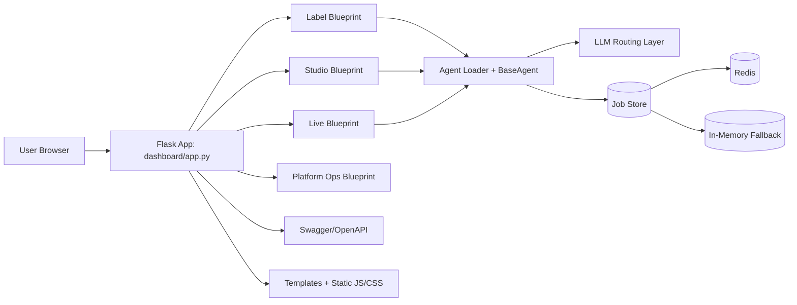

# RPL Evidence Overview - ICT40120 Certificate IV in Information Technology (Web Development)

## 1. Purpose of This Document

I prepared this document as a structured project overview for Recognition of Prior Learning (RPL) evidence.
It explains my work on Maestro AI as a real-world software project and maps that work to the ICT40120 (Web Development) competency context.

Use this document as:
- a project summary for assessors,
- a guide to locate technical evidence in the repository,
- a draft narrative for interview and self-assessment responses.

This version is written in first person so it can be used directly in my RPL narrative.

---

## 2. Project Overview (Maestro AI)

Project name: Maestro AI  
Repository: https://github.com/lrrecords/maestro-ai  
Current release context: v1.5.x (2026)  
Primary domain: operations platform for independent music labels, studios, and live teams.

In this project, I worked on a modular web platform that combines:
- Flask backend services,
- multi-agent orchestration,
- role-based and token-based access controls,
- web dashboards for operational workflows,
- local-first and cloud-capable LLM routing,
- production deployment support (Docker/Procfile/Railway).

The product focus is workflow automation and operational support, with a deliberate human-in-the-loop control model for protected actions.

---

## 3. High-Level Architecture

Core technical characteristics:
- Modular blueprint routing by department.
- Centralized agent base class and LLM client abstraction.
- Persistent job state through Redis with fallback mode for development/testing.
- Configurable provider routing for Ollama, Anthropic, OpenAI/ChatGPT, DeepSeek, Gemini, OpenAI-compatible endpoints, and LiteLLM.

---

## 4. Technology Stack

## Backend
- Python 3.11+
- Flask (web server, routing, sessions)
- Flask-Limiter (rate limiting)
- Flasgger (Swagger/OpenAPI docs)
- Redis (persistent job store)
- Requests/OpenAI SDK/Anthropic SDK/LiteLLM (provider integrations)

## Frontend
- Server-rendered HTML templates (Jinja/Flask templates)
- JavaScript for UI actions, form submissions, run workflows, and dynamic rendering
- CSS for dashboard styling

## DevOps and Operations
- Dockerfile for container builds
- Procfile launch path for hosted runtime
- Environment-based configuration through .env
- Railway hosting path documented and smoke-tested

## Security and Access
- Session-based dashboard login flow
- API token auth (`X-MAESTRO-TOKEN` or Bearer token)
- Webhook secret validation (`X-WEBHOOK-SECRET` or Bearer token)

---

## 5. Backend Implementation Summary

## Application entry point and platform wiring
Key file: `dashboard/app.py`

What I implemented and demonstrated:
- Flask app initialization and blueprint registration.
- Session authentication workflow (`/login`, `/logout`, guarded routes).
- Environment variable loading and secret/token handling.
- Rate limiting configuration and OpenAPI specification serving.

## Agent framework
Key file: `core/base_agent.py`

What I implemented and demonstrated:
- Object-oriented base class design.
- Reusable helper methods for LLM calls, JSON parsing, output persistence, and summary updates.
- Fault handling for empty/malformed LLM outputs.

## LLM provider abstraction
Key file: `core/llm_client.py`

What I implemented and demonstrated:
- Provider-agnostic routing design.
- Config-driven provider selection.
- API integration patterns with multiple providers.
- Backward-compatible provider alias handling.

## Job persistence and reliability
Key file: `core/job_store.py`

What I implemented and demonstrated:
- Redis-backed persistence strategy.
- Graceful fallback to in-memory mode.
- CRUD-style state operations for job lifecycle.

---

## 6. Frontend Implementation Summary

Primary UI locations:
- `templates/hub.html`
- `templates/agents_list.html`
- `templates/dept_live.html`
- `templates/dept_studio.html`
- `templates/index.html`
- `dashboard/static/js/`
- `dashboard/static/css/`

What I implemented and demonstrated:
- Multi-page dashboard navigation and task-oriented UI flows.
- Agent execution entry points and result displays.
- Department-specific operational pages.
- Progressive enhancement approach using template rendering plus JS interactions.

---

## 7. Onboarding and User Guide Evidence

Primary documentation:
- `README.md`
- `docs/quickstart.md`
- `docs/LIVE_USER_ONBOARDING.md`
- `docs/LLM_PROVIDER_SETUP_MATRIX.md`

What I implemented and demonstrated:
- Installation and environment setup instructions.
- Self-host and hosted onboarding paths.
- User access workflow and operational walkthrough guidance.
- Troubleshooting and token rotation procedures.

---

## 8. Deployment and Cloud Evidence

Primary files:
- `Dockerfile`
- `Procfile`
- `app.py`
- `dashboard/app.py`
- smoke-test scripts and release docs

What I implemented and demonstrated:
- Containerized deployment workflow.
- Process launch configuration for hosted environments.
- Separation of configuration from code using environment variables.
- Hosted access validation and production smoke testing practices.

---

## 9. Testing and Quality Practices

Primary evidence:
- `tests/` suite (pytest)
- Focused tests such as `tests/test_llm_client.py`

What I implemented and demonstrated:
- Automated verification of provider routing behavior.
- Error handling and deterministic tests through mocking.
- Regression protection when introducing new provider integrations.

Recommended evidence to include in RPL pack:
- test run output screenshots,
- selected test files with brief explanation,
- changelog/release notes proving iterative quality improvements.

---

## 10. Security, Privacy, and Operational Controls

Evidence sources:
- auth and token checks in runtime routes
- webhook shared secret mechanism
- docs describing mandatory secrets and safe onboarding
- compliance/supporting docs under `docs/`

Security capabilities I implemented and validated:
- authenticated access control to dashboard/API routes,
- protected webhook ingress,
- separation of secrets from source code,
- documented operational procedures (token rotation, onboarding safeguards).

---

## 11. Mapping to ICT40120 Unit Context (Project-Relevant)

The table below shows likely relevance. Final evidence sufficiency is determined by your assessor and your personal contribution scope.

| Unit | Relevance in Maestro | Suggested Evidence |
|---|---|---|
| ICTICT426 Identify and evaluate emerging technologies and practices | Evaluated and integrated multi-provider LLM routing and local-first vs cloud options | `core/llm_client.py`, release notes, architecture notes |
| ICTPRG302 Apply introductory programming techniques | Python scripting, functions, control flow, data structures in Flask/agent code | `dashboard/app.py`, `core/base_agent.py`, commit history |
| ICTICT451 Comply with IP, ethics and privacy policies in ICT environments | Human-in-the-loop design, auth requirements, confidentiality guidance in docs | `README.md`, `docs/quickstart.md`, policy docs |
| ICTAII401 Identify opportunities to apply AI/ML/DL | Practical AI orchestration use cases across operations workflows | `core/llm_client.py`, `agents/`, `docs/MAESTRO_MARKETING_PLAN.md` |
| BSBXCS404 Contribute to cyber security risk management | Token auth, webhook secret controls, access restrictions, deployment cautions | `dashboard/app.py`, `docs/LIVE_USER_ONBOARDING.md`, `.env.example` |
| ICTICT443 Work collaboratively in the ICT industry | Open-source workflow, docs, issue/PR/commit discipline | git history, README contribution guidance |
| ICTSAS432 Identify and resolve client ICT problems | Troubleshooting docs, onboarding fixes, environment diagnostics | `docs/LIVE_USER_ONBOARDING.md`, `docs/quickstart.md` |
| BSBCRT404 Apply advanced critical thinking to work processes | Architecture trade-offs: local-first + cloud optional, fallback persistence | `core/job_store.py`, release notes, design rationale |
| ICTCLD301 Evaluate characteristics of cloud computing solutions and services | Railway hosting model and cloud integration analysis | deployment docs, hosted onboarding docs |
| ICTWEB432 Design website layouts | Department dashboards and navigation templates | `templates/hub.html`, department templates |
| ICTWEB431 Create and style simple markup language documents | HTML template development and styling conventions | `templates/`, `dashboard/static/css/` |
| ICTWEB434 Transfer content to websites | Deployed docs/UI content updates and hosted changes | release notes, docs updates, deployment workflow |
| ICTWEB433 Confirm accessibility of websites | UI structure and user guidance (supplement with explicit accessibility checks if available) | templates, QA notes, screenshots |
| ICTWEB450 Evaluate and select a web hosting service | Hosted deployment path and launch-chain documentation | `Procfile`, `README.md`, `docs/quickstart.md` |
| ICTWEB452 Create a markup language document | Additional template/page authoring and maintenance | `templates/*.html` changes |
| ICTWEB443 Implement search engine optimisations | Limited direct evidence in app dashboard context; provide website/landing evidence if available | landing page files under docs/site artifacts |
| ICTDBS416 Create basic relational databases | Core runtime uses Redis and JSON; provide separate relational DB evidence if required | supplementary SQL/DB project artifacts |
| ICTWEB451 Apply structured query language in relational databases | Limited direct SQL in main runtime; provide supplementary SQL tasks or coursework | SQL scripts, class projects, DB exercises |
| ICTICT435 Create technical documentation | Extensive product, onboarding, security, and release docs | `README.md`, `docs/`, `RELEASES.md` |
| ICTCLD401 Configure cloud services | Environment configuration, cloud deployment settings, token/secret management | Railway/deploy docs, `.env.example`, runbooks |

Note on SQL/relational units:
- Maestro is strong in web app architecture, deployment, and operations.
- SQL/relational-specific units may require supplementary evidence beyond this repository.

Supplementary evidence plan:
- I can include a second project evidence set (Artist-Pages) for SQL/Supabase-focused units.
- This is especially useful for `ICTDBS416`, `ICTWEB451`, and cloud configuration evidence where relational data modeling/query work is required.

Concrete supplementary evidence identified:
- Artist-Pages README and setup documentation describe a Supabase-backed artist platform (auth, database, storage, RLS).
- SQL setup scripts include table creation, policy definitions, and idempotent schema operations.
- Seed scripts demonstrate practical SQL usage for inserts/upserts and JSONB-based application data structures.
- Short-link SQL script demonstrates relational table design with primary key, foreign key, index, and row-level security policy controls.

---

## 12. Evidence Portfolio Checklist (RPL Submission Support)

Use this checklist when assembling attachments:

- Current resume with software/web development responsibilities.
- Project overview (this document).
- GitHub repository link and selected commit history screenshots.
- Code samples from backend (`dashboard/app.py`, `core/*`) and frontend (`templates/*`, JS files).
- Deployment evidence (Docker/Procfile/hosted runbook/screenshots).
- Test execution evidence (`pytest` outputs, selected test files).
- Documentation evidence (`README.md`, quickstart, onboarding, release notes).
- Third-party verification (supervisor/client references) describing your actual contribution.

---

## 13. Candidate Contribution Statement Template

Replace bracketed fields with your details before submission.

I, [Candidate Name], contributed to Maestro AI by:
- [Example: implementing and updating backend routing and authentication controls],
- [Example: creating and maintaining dashboard templates and user flows],
- [Example: integrating and testing multi-provider LLM routing],
- [Example: preparing deployment and onboarding documentation for users].

The evidence in this repository demonstrates practical web development capability across:
- backend application development,
- frontend template and UI workflow implementation,
- deployment/configuration practices,
- technical documentation and operational support.

---

## 14. Suggested Submission Package Structure

- `01_Project_Overview_RPL.pdf` (export of this file)
- `02_Resume.pdf`
- `03_Repository_Evidence_Index.pdf` (list of file paths + screenshots)
- `04_Code_Samples_Backend.pdf`
- `05_Code_Samples_Frontend.pdf`
- `06_Test_and_Deployment_Evidence.pdf`
- `07_Referee_and_Verification_Documents.pdf`

---

## 15. Assessor Notes (Optional Cover Paragraph)

This evidence package demonstrates my applied, workplace-relevant web development experience through a production-oriented Flask platform with multi-module frontend/backend integration, cloud deployment support, security controls, technical documentation, and iterative release management.

---

## 16. Supplementary Project Integration (Artist-Pages / Supabase)

I am attaching Artist-Pages as supplementary evidence to strengthen relational database and cloud-backend competencies.

Supplementary project location:
- External folder provided by candidate: `c:\Users\brett\Documents\lrrecords-artist-pages\artist-pages`

Evidence currently available from Artist-Pages:
- `README.md`: project architecture, Supabase data model, and security model.
- `SET_UP_GUIDE.md`: SQL table creation, RLS enablement, and policy setup workflow.
- `supabase-seed.sql`: practical SQL `insert` and `on conflict do update` examples using JSONB fields.
- `supabase-short-links.sql`: relational table setup with foreign key to `auth.users`, unique index, RLS, and per-owner policies.
- `SUPABASE_SCHEMA.md`: Web3-related schema extension approach and operational review-state contract.
- `artist-page.js` + `supabase-config.js`: frontend integration with Supabase client and runtime configuration.

How this strengthens ICT40120 RPL:
- Direct relational database creation/query evidence for `ICTDBS416` and `ICTWEB451`.
- Additional cloud service configuration evidence for `ICTCLD301` and `ICTCLD401`.
- Broader end-to-end web application evidence across both Flask-based and Supabase-backed stacks.

Practical SQL features demonstrated in supplementary evidence:
- `create table if not exists`.
- `primary key` and `references ... on delete cascade`.
- `create unique index if not exists`.
- `insert into ... values ... on conflict (...) do update`.
- `alter table ... enable row level security`.
- `create policy ... using ... with check ...` for owner-scoped access control.

